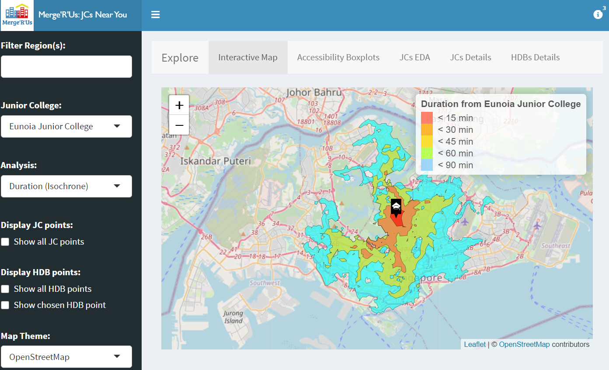

 
```{r setup, include=FALSE}
knitr::opts_chunk$set(echo = FALSE)
```
 
# Issues and Problems
Since 2014, the Ministry of Education of Singapore has called for the amalgamation and relocation of some schools, including primary schools, secondary schools as well as Junior Colleges. This is reported to be due to the fall in birth rate that led to lesser demand for education services and changes in geographical distribution of students. The Ministry then found the mergers necessary as low enrolment impacts the quality of learning opportunities provided to students [@moe].  As a result, there is an adverse impact on accessibility for some students due to the relocation of schools.
 
 
# Motivation
 
Many families have been impacted in terms of accessibility due to the policy, with some moving houses or being inconvenienced. We wish to explore the extent of this and identify the areas impacted. Did the decisions meet its aim, or did it do more harm than good? We are curious about this, and regardless, if any area was impacted adversely, it would be good for measures to be implemented by the government for assistance.
 
This is hard to solve because while the initial announcement was a few years back, this situation remains prevalent. There are still future plans for relocation, for example Yusof Ishak Secondary School from an area where demand for school places is falling to Punggol in 2021 to meet the growing demand [@relocation]. While this is grounded, we wonder about the sustainability of moving schools everytime the demand falls. As the downward trend in Singapore's population growth continues, there might be more of such cases to come, which is a cause for concern.
 
# Approach
Calculations of HDB to Junior college
 
- Get distance and duration from HDB to nearest public transport with API
- Get the distance and duration of the public transport of the HDB to the nearest public transport of the respective Junior College
 
Accessibility Maps
 
- Isochrone Mapping used to measure accessibility based on the duration taken to travel from a certain point to the JC
- Shorter duration, higher accessibility of school from HDB
 
Used Hansen’s Potential Model and Spatial Accessibility Measure
 
- Calculate the accessibility values of both Hansen and SAM 
- Compare the accessibility values using box plots and histograms
- Use Comparison Analysis on the Hansen and SAM boxplots observations
 
# Results
 
Accessibility Boxplots
 
- Compare the distribution of Hansen and SAM by planning region
- Saint Andrew’s JC analyse for distance as shortest travel distance
- Distance: highest accessibility in Central, very low in North, East, West
- Lower spread but higher values for SAM distance to Hansen Distance
- Saint Andrew’s JC analyse for duration as shortest travel duration
- Same result on comparison for Hansen and SAM
 <center>
{width=75%}
 </center>
 <center>
{width=75%}
 </center>
 
Map
 
- Isochrone for Tampines Meridian JC reflected outliers 
- Catholic and Saint Joseph’s JC are left-skewed with travel time between 15 to 60 minutes as reflected on Isochrone
- Isochrone shows that the travel time to Millennia Institute is 60 to 90 minutes. The school is blocked by non-industrial areas, leads to small HDB population and long travel duration.
- Cluster of JCs in Central, strategized by government
- Through Hansen maps, Saint Andrew’s JC accessible to most HDB points while Millennia Institute is accessible mainly in the West
- Hansen Distance reflects lower accessibility for Saint Andrew’s JC but higher accessibility for Millennia Institute VS Hansen Duration
 

 
# Future Work
 
- Analyse demand and supply of Junior colleges
- Conduct spatio-temporal analysis to compare the effect of the merger 
- Use of buffers and considering more forms of transportation 
- Explore different types of distance measures
- Use more recent dataset if possible
- Improve the usability of our application
 
# Conclusion
Isochrone, Hansen and SAM accessibility models led us to learn that there are many neighbourhood housing developments that have low or no access to Junior Colleges. To cater for those students who are affected by the amalgamation due to the fewer Junior Colleges worldwide, local authorities can use our application to visualise the areas which have low access to Junior Colleges. Our application has also pointed out the region, West, and the Junior College, Millennia Institute, with the lowest accessibility. More development like increasing the number of public transport from those HDB locations in the West region as well as the accessibility from Millennia Institute to improve the accessibility of JCs.
 
```{r, include=FALSE}
knitr::write_bib(c('knitr','rmarkdown','posterdown','pagedown'), 'packages.bib')
```
 
# References
 
---
references:
- id: moe
  title: Why is the Ministry of Education merging some schools?
  author:
  - given: Lianne
  issued:
    year: 2017
    month: 4
  URL: https://www.gov.sg/article/why-is-the-ministry-of-education-merging-some-schools
- id: relocation
  title: MOE to relocate Yusof Ishak Secondary from Bukit Batok to Punggol
  author:
  - family: Chia
    given: Lianne
  issued:
    year: 2018
  URL: https://www.channelnewsasia.com/news/singapore/yusof-ishak-secondary-bukit-batok-punggol-move-moe-10716654
...

