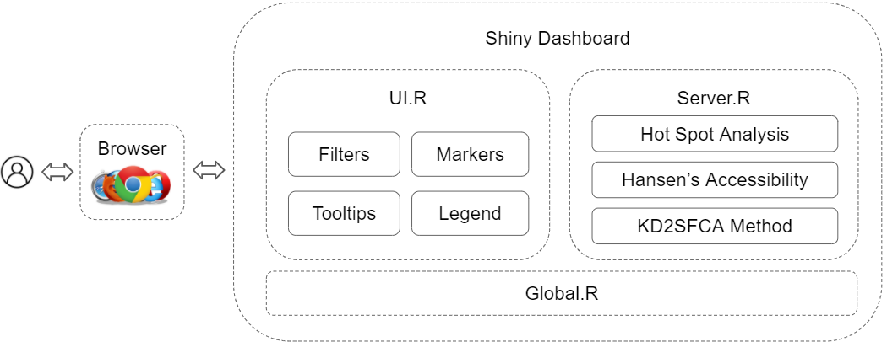

# Introduction 

The Ministry of Education (MOE) of Singapore has called for the amalgamation and relocation of some schools, including primary schools, secondary schools as well as junior colleges.

This is reported to be due to the fall in birth rate that led to lesser demand for education services and changes in geographical distribution of students. As a result, there is an adverse impact on accessibility for some students.

## Project Objectives
In our project, we will build an application to investigate the effect of the new locations of the affected schools on the spatial accessibility to Junior College (JC) students.

Mainly, we wish to create an isochrone map and visualise the modelling results of Hansen accessibility model and Spatial Accessibility Measure.

We will then analyse and interpret the output. We are also interested in identifying the affected residential areas which require more attention and comment on potential amalgamation by doing evaluations and stating the challenges.

## Project Motivation

Many families have been impacted in terms of accessibility due to the policy, with some moving houses or being inconvenienced. We wish to explore the extent of this as well as identify the areas impacted. Did the decisions meet its aim, or did it do more harm than good? We are curious about this, and regardless, if any area was impacted adversely, it would be good for measures to be implemented by the government to assist the families affected.

While the initial announcement was a few years back, this situation remains prevalent. There are still future plans for relocation, for example Yusof Ishak Secondary School from an area where demand for school places is falling to Punggol in 2021 to meet the growing demand [@relocation]. While this is grounded, we wonder about the sustainability of moving schools everytime the demand falls. As the downward trend in Singapore's population growth continues, there might be more of such cases to come, which is a cause for concern.

At the same time, the rather recent lavish national expenditure on the building of the new Eunoia JC raised many eyebrows. Many questioned if the move was called for in light of the closures and mergers of the other schools [@commentary], and this is an interesting issue that we can look into on the side. 

Moreover, this topic is close to home as we have members whose JC was merged. Hence, we wish to visualise the and analyse the impact, and perhaps allow insight to be derived on the ideal locations of schools. 

# Reviews of Past Projects

An existing application we reviewed was Balancing Urban Residential Plannings (BURP) [@burp]. This project looked into the impact of accessibility for families in residential housing after school mergers in Singapore. They calculated the distance of HDB flats to schools and used kernel density of HDBs as part of their algorithms. Isochrone maps were also used to showcase the results. We also tried out their application and evaluated them as follows.

The application did well in displaying accessibility well displayed by travel time with public transport and Hansen Accessibility (based on duration or distance). They logically took public transport into account for accessibility and their use of kernel density is useful to see if HDB clusters are near a school.

The team also identified some rooms for improvements as follows. The application is unable to view the accessibility to schools given an address or location. Moreover, selecting another analysis method will uncheck the current checkbox. This is confusing for the user. A dropdown will be more intuitive as users will know that they are looking at only 1 model at a time.

We aim to address these concerns, and implement the future work mentioned for identifying ideal locations for schools.

Another study [@sas] had the aim of assessing if the locations of current (and upcoming) healthcare facilities are equally accessible by the senior population in Singapore. Methodologies applied include spatial point pattern analysis In the data exploration stage. They include Kernel Density Estimation, First Order Distance-based and Second Order Distance-based functions and are used to understand the distribution of General Practitioner (GP) clinics and the interaction between the distribution of these clinics and that of the population. They also used gravity models to evaluate the accessibility of healthcare services to the senior population. Examples include Hansen Potential Model, Spatial Accessibility Measure (SAM) and 2-Step Floating Catchment Area (2SFCA). 

The next study [@kernel] looks into the improved version of two-step floating catchment area (2SFCA) method and the kernel density 2SFCA (KD2SFCA) method. The method was applied to assess the accessibility of the Portuguese hospital health care sector to see how well it performed as compared to the normal 2SFCA method. It was concluded that the KD2SFCA was able to better identify the accessibility of healthcare for the population. 

# Project Approach

In our project, we will implement the methodologies covered by the case study, while also learning from the BURP application as reviewed in the previous literature review section. We will also add in other functionalities not covered. 

Firstly, using Hansen’s Accessibility Index, we can measure accessibility of an estate area based on the number of schools, weighted by the travel time required. More time needed means less attractive.

# Application System Architecture & Overview

The main files driving the Shiny app dashboard that the user interacts with are as follows:

UI.R is supported by the server for rendering information, and will showcase the functionality outputs on the maps. Users can further interact with the models by filtering the schools they want to look at, and there will be point markings, tooltips and legends provided to show additional information that may be useful.

Server.R will do the back-end work, generating the information from the models. The core functionalities of our application is the accessibility models to see the duration and/or distance and localised geographical statistics that lets us identify the cold spot and hot spot areas.

Global.R lets us load the relevant libraries and datasets for the server and the UI, which allow us to perform various forms of analysis.

# Application Storyboard

In our dashboard, we will have a Map and About tab. The following screenshots show a prototype of the Map tab.

In the map tab, they can apply various filters to see the results they want. Namely, they can choose the following:

- Region to see the schools in that area at one glance
- School(s) with multi-select enabled in the dropdown function
- Type of analysis, which can be one of the following options:
  - Distance (Hansen Accessibility)
- Type of points the user wants to do the analysis on. It could be either population or housing data points
- Preferences to show accessibility points and/or legend, and the map type  

Users can also find out more information about the application and how to use it in the About tab. 

# References

---
references:
- id: relocation
  title: MOE to relocate Yusof Ishak Secondary from Bukit Batok to Punggol
  author:
  - family: Chia
    given: Lianne
  issued:
    year: 2018
  URL: https://www.channelnewsasia.com/news/singapore/yusof-ishak-secondary-bukit-batok-punggol-move-moe-10716654
- id: commentary
  title: Look beyond state-of-the-art campuses for what matters in education
  author:
  - family: Tee
    given: Karen
  issued:
    year: 2020
  URL: https://www.channelnewsasia.com/news/commentary/eunoia-junior-college-new-campus-singapore-moe-budget-elitism-12249726
- id: burp
  title: Balancing Urban Residential Plannings (BURP), Visualising the Public Schools Accessibility to Residential Housings.
  author: 
  - family: Tan
    given: Peng Chong
  - family: Brendo
    given: Austin
  - family: Goh
    given: Rebecca
  issued:
    year: 2019
- id: sas
  title: Is there a Space for SAS® Viya® in Healthcare?
  author:
  - family: Lim
    given: Evelyn
  issued:
    year: 2019
- id: kernel
  title: An extended kernel density two-step floating catchment area method to analyze access to health care 
  author:
  - family: Polzin
    given: Pierre
  - family: Borges
    given: José
  - family: Coelho
    given: António
  issued:
    year: 2014
  URL: https://journals-sagepub-com.libproxy.smu.edu.sg/doi/pdf/10.1068/b120050p
...

