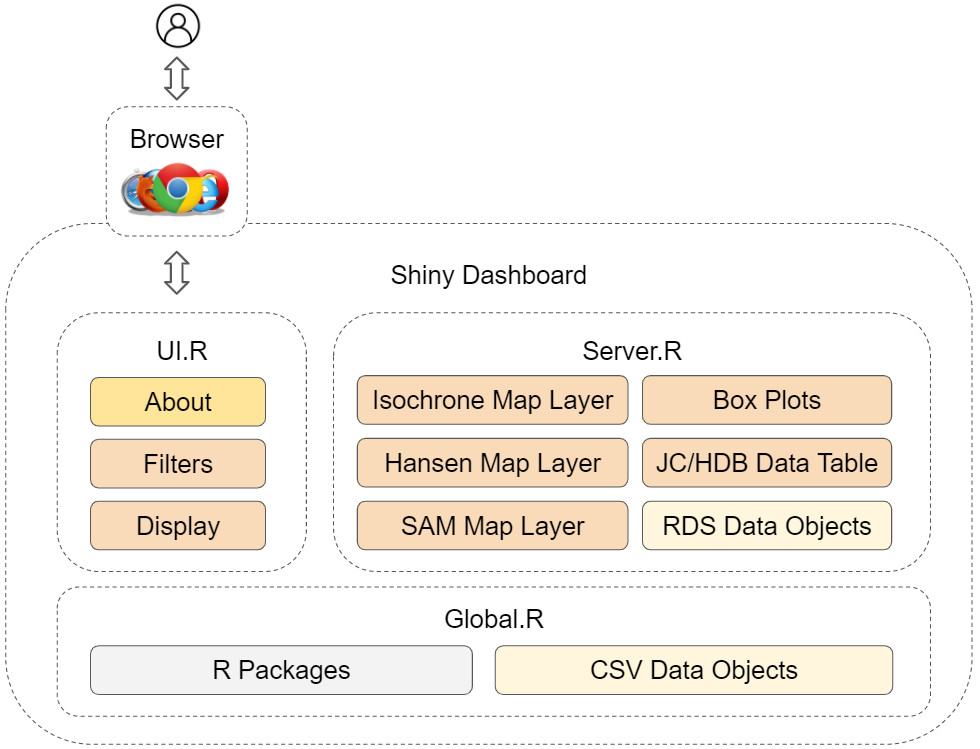
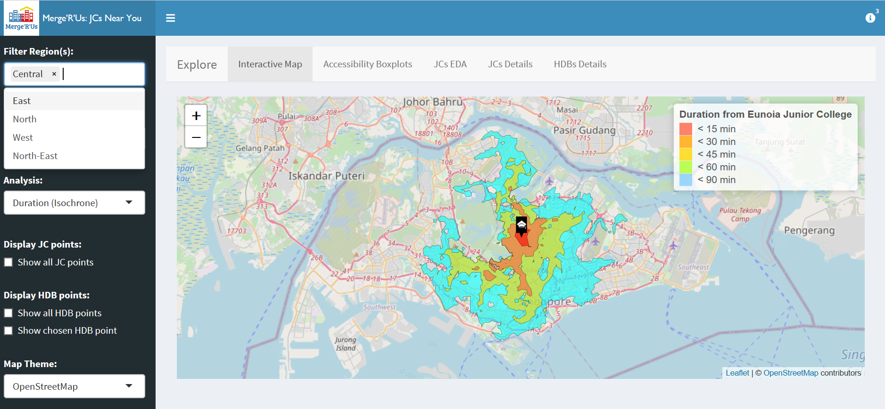
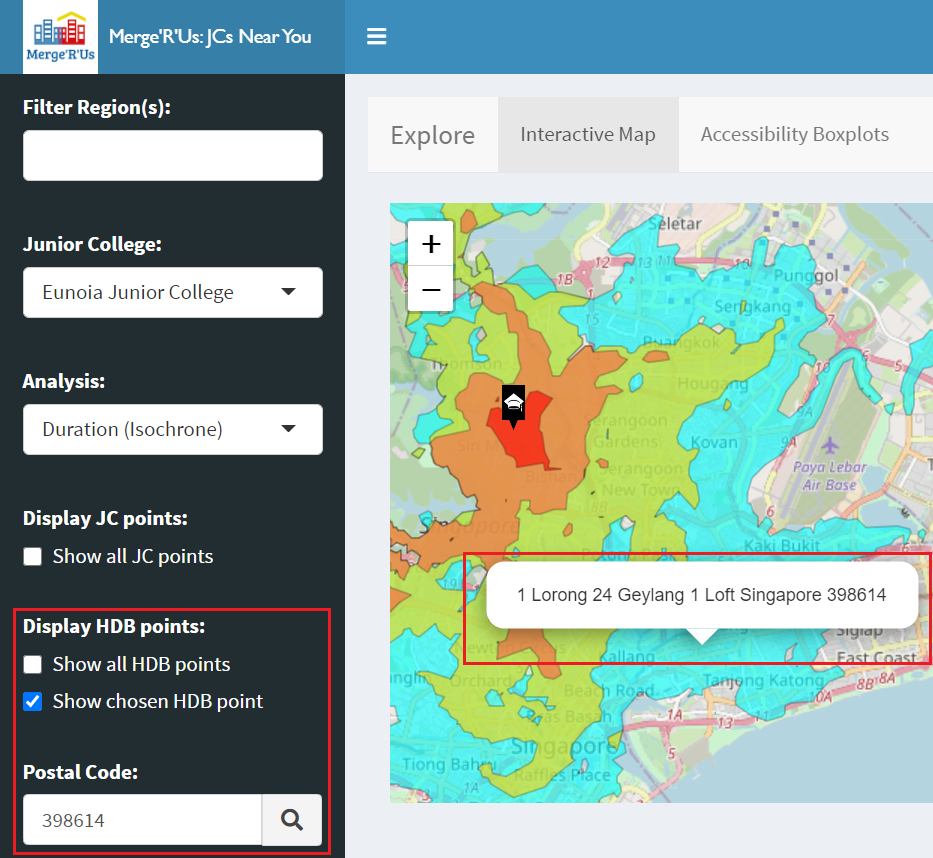
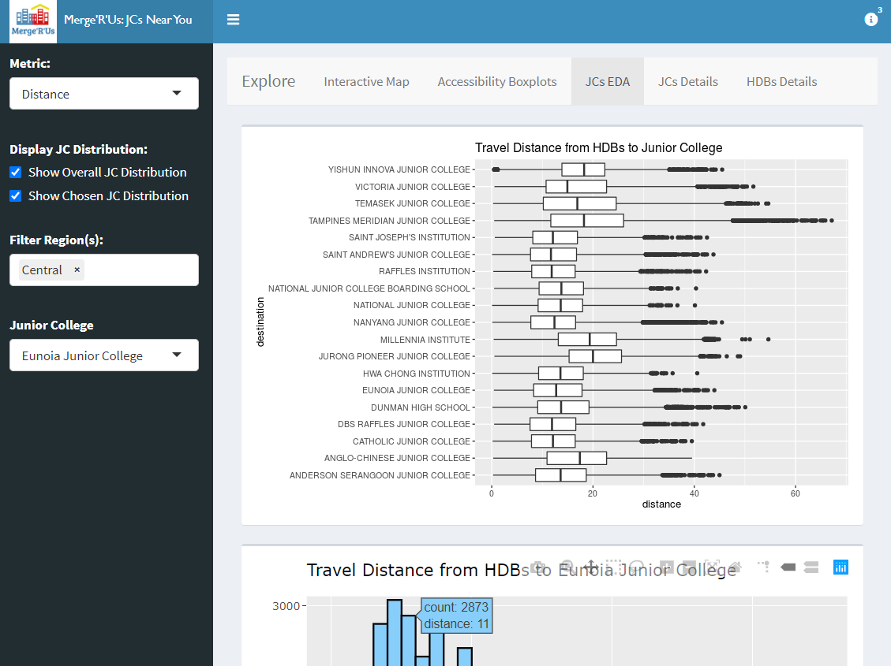
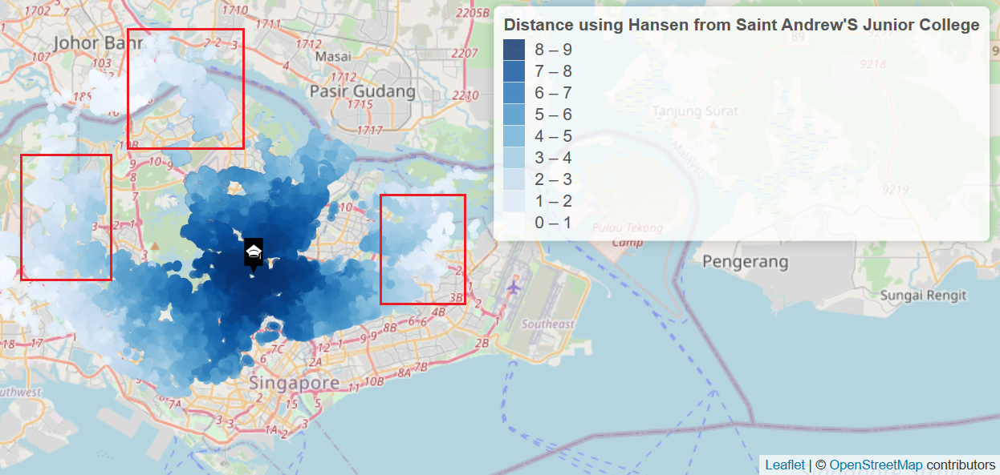

# Introduction 
Since 2014, the Ministry of Education of Singapore has called for the amalgamation and relocation of some schools, including primary schools, secondary schools as well as Junior Colleges. This is reported to be due to the fall in birth rate that led to lesser demand for education services and changes in geographical distribution of students. The Ministry then found the mergers necessary as low enrolment impacts the quality of learning opportunities provided to students [@moe].  As a result, there is an adverse impact on accessibility for some students due to the relocation of schools.

## Project Objectives
In our project, we will build an application to investigate the effect of the new locations of the affected schools on the spatial accessibility to Junior College students. 

Mainly, we wish to create an isochrone map and visualise the modelling results of Hansen accessibility model and Spatial Accessibility Measure. We will then analyse and interpret the output. We are also interested in identifying the affected residential areas which require more attention.

## Project Motivation
Many families have been impacted in terms of accessibility due to the policy, with some moving houses or being inconvenienced. We wish to explore the extent of this as well as identify the areas impacted. Did the decisions meet its aim, or did it do more harm than good? We are curious about this, and regardless, if any area was impacted adversely, it would be good for measures to be implemented by the government to assist the families affected.

While the initial announcement was a few years back, this situation remains prevalent. There are still future plans for relocation, for example Yusof Ishak Secondary School from an area where demand for school places is falling to Punggol in 2021 to meet the growing demand [@relocation]. While this is grounded, we wonder about the sustainability of moving schools everytime the demand falls. As the downward trend in Singapore's population growth continues, there might be more of such cases to come, which is a cause for concern.

At the same time, the rather recent lavish national expenditure on the building of the new Eunoia Junior College raised many eyebrows. Many questioned if the move was called for in light of the closures and mergers of the other schools [@commentary]. This is an interesting issue we can look into on the side. 

Moreover, this topic is close to home as we have members whose Junior College was merged. Hence, we wish to visualise and analyse the impact, and perhaps allow insight to be derived on the ideal locations of schools. 

# Related Work
An existing application we reviewed was Balancing Urban Residential Plannings (BURP) [@burp]. This project looked into the impact of accessibility for families in residential housing after school mergers in Singapore. They calculated the distance of HDB flats to schools as part of their algorithms. Isochrone maps were also used to showcase the results. We also tried out their application and evaluated them as such

The application did well in displaying accessibility well displayed by travel time with public transport and Hansen Accessibility (based on duration or distance). They logically took public transport into account for accessibility and their use of kernel density is useful to see if HDB clusters are near a school.

The team also identified some rooms for improvements as follows. The application is unable to view the accessibility to schools given an address or location. Moreover, selecting another analysis method will uncheck the current checkbox. This is confusing for the user. A dropdown will be more intuitive as users will know that they are looking at only one specific model at a time.

We aim to address these concerns, and implement the future work mentioned for identifying ideal locations for schools.

Another study, Is there a Space for SAS® Viya® in Healthcare? [@sas] had the aim of assessing if the locations of current (and upcoming) healthcare facilities are equally accessible by the senior population in Singapore. The exploratory data analysis they performed included box plots and histograms to compare the travel distance from HDB blocks to different hospitals as can be seen in the following figures 1 and 2. We find them useful to adopt in our application.

Methodologies applied include spatial point pattern analysis In the data exploration stage. They include First Order Distance-based and Second Order Distance-based functions and are used to understand the distribution of General Practitioner (GP) clinics and the interaction between the distribution of these clinics and that of the population. They also used gravity models to evaluate the accessibility of healthcare services to the senior population. Examples include Hansen Potential Model, Spatial Accessibility Measure (SAM) and 2-Step Floating Catchment Area.

# Data Collection
The first dataset we used provides the Junior College information. We retrieved it using OneMap API and converted the response into "Jc.csv". The data contains the fields for school name, postal code, latitude, longitude, X-coordinate, Y-coordinate, road name, address and region of each school. 

The HDB property dataset "sg_zipcode_mapper.csv" is retrieved from Kaggle which contains a list of all postal code extracted from Singapore, including address, latitude and longitude and road name. The Kaggle dataset combines data from data.sg and the OneMap API to create a holistic dataset. We used HDB resale flat price from data.gov.sg to get the postal code and retrieve the proper address, latitude and longitude of each HDB from OneMap API. Python code is then used to extract the information [@onemap].

We also procured the Master Plan 2014 Subzone Boundary (Web) data from data.gov.sg to obtain the region information for the Junior Colleges and the HDBs. Performing a join using the coordinates, we are able to merge it into the respective Junior College and HDB data. 

The next data we have used is the General Transit Feed Specifications (GTFS) collected from singapore-gtfs repository [@gtfs]. It contains data of transit agencies file, distinct routes file which can be bus number or MRT line, trips file, frequencies file, stop_times file, geographic locations of the stops and calendar file which defines the service pattern. 

The last dataset "Singapore.osm.pbf" is the Singapore’s OpenStreetMap PBF which contains the data of geographical area of interest. This PBF data would be used alongside the Open Planner (OTP) API ("otp.jar") to help us in calculating the isochrones and the distance matrices. We will have to build the graph object by running the command `java -Xmx2G -jar otp.jar --build graphs/current` and proceed to run the OTP server by running the command `java -Xmx2G -jar otp.jar --router current --graphs graphs --server`. After the OTP server is up and running on our local server at http://localhost:8080, we will be able to proceed to our next step which is data generation. 

To get the calculations, both the distance and duration, of HDB flats to desired Junior College, we generated distance matrices from each school to different HDB points using the OTP API by stating the router link and indicating the type of transport as walk and transit. We did this in data.RMD, which is used to do all our data generation. The time indicated for all OTP API generations are standardized at 7am, which is the peak hour where students travel to school. We have also indicated the maximum walking distance as 1600 metres. This is as we feel that it is a reasonable walking distance from school. The distance matrices are then stored as a .rds file for future application of Hansen and SAM, which is covered in the next section.

# Methods
In our project, we implemented the methodologies covered by the case study, while also learning from the BURP application as reviewed in the previous literature review section. We also added other functionalities that were not covered. 

Accessibility is a term that is widely used for geospatial analysis for transport studies. Many literature studies have normally combined 2 components when addressing the accessibility measure which are the transport impedance and locational attractiveness. We will be analysing the aggregated spatial interaction model between HDB and Junior Colleges in our research paper. 

Firstly, we implemented Isochrone mapping. This mapping is useful in measuring the accessibility of a Junior College based on how long it will take to travel from a certain point and time to the Junior College. The shorter the duration, the higher the accessibility of the school from the HDB point. Isochrone travel times were generated via the OTP API but instead of using the router link used for distance matrices, we made use of the isochrone link and indicated the same information [@xang].

Next, using Hansen’s Potential Model, we are able to measure the accessibility of each Junior College, which is defined as the “opportunity which an individual at a given location possesses to take part in a particular activity or set of activities” with a certain cost (such as distance or time) [@hansen]. In this case, the accessibility for each Junior College is calculated by looking at the potential that a person is willing to travel to the school based on the distance and duration from the HDB point to the school. The higher the value of Hansen, the higher the accessibility of the school from the HDB point. The formula can be seen in Figure 3.

Lastly, the Spatial Accessibility Measure (SAM) measures the accessibility according to the population of HDB points and supply of a Junior College [@sam]. The accessibility of a Junior College increased with higher population nearby and supply and decreased with longer distances/time from the HDB point to the Junior College. The higher the value of SAM, the higher the accessibility of the school from the HDB point. The formula can be seen in Figure 4.

For this project, we calculated both Hansen and SAM accessibility using the ac() function provided by the SpatialAcc package. This involves specifying the distance or duration matrix  generated from Open Trip Planner API, and indicating power to 2 following the theory of gravity model in geography. As we are unsure of the population of each HDB point and the supply for each Junior College is difficult to gauge, we specified the population to be 100 and supply to be 10, and standardized this figure across all Junior Colleges. This means that we are evaluating the accessibility of each Junior Colleges purely based on distance or duration and more time needed or longer distance means less attractive. 

The algorithmic implementations for the above methodologies are done in the data.RMD file. The result we got from generating the isochrones, and the calculations on Hansen and SAM using ac() function for each Junior College are stored as .rds files for use by the application. The specific implementation will be covered in the next section.

# Application Implementation
The following figure 5 shows an overview of how our application was built. 

The main files driving the Shiny application dashboard that the user interacts with through their web browser are as follows.

## Global File
Global.R lets us load the relevant libraries and datasets for the server and the UI, which allow us to perform various forms of analysis. 

The R packages we used are as follows.
 
- Shiny features: shiny, shinydashboard, shinyWidgets
- Data manipulation: tidyverse which contains packages like dplyr and tidyr
- Spatial data handling for objects: sp
- Map: tmap
- Box plot: ggstatsplot
- Data table: DT

In our project, we used this file to create data objects to store our Junior College and HDB csv data. As not all the fields are relevant or in the format we want, we also perform data wrangling here. We performed joins to get the regions of the HDBs and Junior Colleges, and filtered the data.frame to include columns that we want. We also changed the format of the values to convert them from uppercase to camel case for more presentable display on the UI. We also set both data objects to the same coordinate reference systems, 3414, to coincide with that of Singapore’s.

## UI File
The UI.R file contains the dashboard layout and input components for our application, the functionalities provided of which are highlighted in the next section. Users can further interact with the models by applying the filters provided by UI.R, and the selection provided by the user will be communicated to the server, which will return the functionality output to be displayed on the interface such as the different types of maps, the box plots and the data tables. 

## Server File
As mentioned above, the server supports the UI for rendering information. It observes input events by the UI, and when the user inputs their selections, Server.R will do the back-end work required, generating the information from the models to be displayed on the UI. 

The core functionalities of our application are the isochrone and accessibility models to see the duration and/or distance. Upon selecting a Junior College or analysis type, the server will determine which is the analysis type chosen, and carry out the function to create the map layer based on the Junior College selected. The analysis for the Junior College is obtained by reading the respective RDS file file generated from data.RMD as sp SpatialPointsDataFrame object to be displayed on the map using leaflet. Using the pre-generated RDS files improve the performance of the application and allow the output to be shown in a shorter amount of time compared to letting the application generate the information on the spot.

At the same time, the legend is added by the server, as well as tooltips and markers if the user checks the specific checkbox to indicate that they want to see those additional information overlaid on the map layer created as well.

# Application Interface
Our application is a dashboard that allows users to view one of the following at a time: an interactive map, box plots for Hansen and SAM, as well as data tables displaying the information of Junior Colleges and HDBs respectively. The sidebar provides various options to be applied to customise and toggle their display of the component they wish to view. 

To find out more about our application and how to use it, they may click the top right hand button with an information icon to reveal a notification menu. It also contains explanations on the various analyses used to help the user understand the application. 

## Interactive Map
On entering the application, users are brought to the “Interactive Map” tab first. A screenshot of this page is as follows in Figure 6.

In the map tab, users may make use of the following filters to see the results they want: region(s) for the Junior Colleges, Junior College, type of analysis, options to display Junior College and/or HDB points and finally they may customise the map theme.

The Junior College and type of analysis has to be chosen, and they are defaulted to the first options in the list. As the list might get quite long, they can make use of the region(s) input. By multi selecting the regions (see Figure 7), it allows users to narrow their search for the Junior Colleges. This is convenient for users who wish to find Junior Colleges that are in their region. By default, all schools are displayed for selection. 

For analysis type, there are 5 different selections to choose from:

- The ‘Duration (Isochrone)’ choice will display the Isochrone map of the selected Junior College. Areas within the red contour refers to the shortest time needed (within 15 minutes) to go to the selected Junior College thus the highest accessibility, while areas within the light sky blue contour refers to the longest time needed (within 90 minutes) to go to the selected Junior College thus lowest accessibility. 
- The ‘Distance (Hansen)’ and ‘Distance (SAM)’ will display the mapping of Hansen Accessibility and SAM Accessibility based on the distance between HDB points to selected Junior College. HDB points with the darkest blue refers to the highest accessibility while HDB points with the lightest blue refers to the lowest accessibility.
- The ‘Duration (Hansen)’ and ‘Duration (SAM)’ will display the mapping of Hansen Accessibility and SAM Accessibility based on the duration needed to travel from HDB points to selected Junior College. HDB points with the darkest purple refers to the highest accessibility while HDB points with the lightest purple refers to the lowest accessibility.

Hovering over the HDB points for Hansen and SAM mappings will provide the specific accessibility value, address and distance or duration to the school.

After selecting a specific Junior College and analysis, the application will pull out the respective .rds file and display on the interface using leaflet. 

There are several options for users to display other points by ticking the respective checkboxes according to their preference.

Selecting “Show all Junior College points” will display all Junior College points on the current map. Junior Colleges that are nearby will form clusters. The cluster size changes according to zoom level. Click on the cluster ball to view the schools within the cluster. Looking at the Junior College points can help to make the decision on amalgamation and relocation of schools as it allows easy comparison on the accessibility between schools. 

Selecting “Show all HDB points” will display all HDB points on the current map. Hovering over the points will provide the user with the address of each point. A HDB point has been chosen  in Figure 8.

By checking the “Show chosen HDB point” checkbox, a search bar will appear for users to input a valid postal code. A tooltip of the address of the searched postal code will be displayed on the map upon valid search. This helps to identify the accessibility of a certain HDB pointed to the selected Junior College easily.

Users are also given the flexibility to choose the type of map they would like to work on by selecting the “Map Theme” dropdown list. Based on their selection, they may customise if they prefer light or dark themes, and if they want the map to contain other geographical features. 

## Other secondary features
Another tab that users may browse is the “Accessibility Measures” tab as follows in Figure 9.

On this page, they may see the box plot for Hansen and SAM side by side, based on the Junior College they select. From this, they can find out the distribution etc.

Next, users may take a look at the data tables containing information about the Junior Colleges and HDBs. They may perform sorting and search functions on these tables as shown in the screenshots below  in Figure 10 and 11. 

Next, there is a tab for exploratory data analysis on the Junior Colleges as shown in Figure 12. 

This tab allows users to see both the box plots for all the Junior Colleges as well as the histogram for a chosen Junior College. On entering the tab, users will see only the overall box plot graph. They can toggle the metric to choose between “Duration” or “Distance” to represent the variable they wish to explore. If they wish to view the histogram for a specific school, they can select the checkbox and more inputs will appear for them to choose. They can toggle the Junior College and the Region tab also helps them narrow down the list of Junior Colleges like in the Map tab. 

With reference to Figure 13, they may filter the Junior Colleges shown by selecting the regions they want to see. Meanwhile, the HDB table may aid users to find the postal code of an address they search, such that they may input it in the “Show chosen HDB point” map selection input to show the location and details of that specific HDB block.

# Results 
From the application, we may discover new understanding from the data, and we detail it below in this section.

## Exploratory Data Analysis

To gain an initial understanding of the data, our application provides box plots and histograms.

Figure 14 shows the box plot diagram of the Travel Distance from HDBs to all the Junior Colleges. 

Generally, we may observe that most of the travel distance from HDBs to Junior Colleges lies around 15 to 20 kilometres.

We may also observe that most Junior Colleges have a relatively normal distribution of travel distances, as the median for most box plots lie in the centre. However, schools like Victoria Junior College and Eunoia Junior College have a more right-skewed distribution, while Anglo-Chinese Junior College has a more left-skewed one.

Additionally, the spread may vary. In particular, the spread for Tampines Meridian Junior College is the most. This means that some HDBs are very near to the school while some are very far from the school, nonetheless, more HDB points are near to the school than far from it. 

From the diagram, we can also see that Jurong Pioneer Junior College has the longest median travel distance from HDB points in general, followed by Millennia Institute, Tampines Meridian Junior College and Yishun Innova Junior College. Interestingly, the top two schools, Jurong Pioneer Junior College and Millennial Institute are from the West Region, while the next two are from different regions - East and North respectively. 

The above observation shows that Junior Colleges in the West Region are relatively further from HDB points than other Junior Colleges in other regions on average. This may be because they are located in the far West where population might be low.

Both Tampines Meridian and Yishun Innova Junior Colleges have the same median for travel distance, however the travel distance interquartile range for Tampines Meridian is longer as compared to Yishun Innova, indicating a higher variability in data. Thus, we can conclude that Yishun Innova Junior College is further from most HDB points than Tampines Meridian Junior College is, to HDB points. 

It was also noted that the top 3 schools with the shortest travel distance: Saint Andrew’s Junior College, Raffles Institution and DBS Raffles Junior College, are all located in the Central Region. This means that Junior Colleges in the central region are generally nearer to HDB points than other regions which make sense why most Junior Colleges are located in the central region.

Referring to the travel distance for various schools in Figure 15, we observe that for Saint Andrew’s Junior College, most of the HDB points are within 20 kilometers (km) travel distance from the school, which is considerably closer to the school as compared to Jurong Pioneer Junior College where most of the HDB points falls within 20 km to 40 km away from the school. For Millennia Institutions, there are more HDB points that fall between 10 km to 20 km travel distance from the school, signaling that there are more HDB points nearby. However, it is relatively lesser when compared to Saint Andrew’s Junior College. The travel distance for Tampines Meridian is more spread out, ranging from close to 0 to 60 km. This may be due to the fact that the school is near Simei and Changi, the far east of Singapore where there are fewer HDB points and more private residentials. Thus, HDB points within the Tampines region are close to the school while HDB points outside of the region are far from this school. 

Figure 16 shows the box plot diagram of the Travel Duration from HDBs to all the Junior Colleges. 

In general, it is noted that the travelling time from HDBs to most Junior Colleges fall within 50 to 75 minutes. This is because when generating the distance and duration matrixes, we specified walk as one of the mode of transport and stated that the maximum walking distance is 1600 metres which will take around 16 to 18 minutes as per our calculation(see Figure 17, while referencing that 1000 metres takes 10 to 12 minutes [@verywellfit]) and this duration may be included in the travelling time. 

We also observed that the most of the Junior Colleges have a normal distribution of travel time, Catholic Junior College and Saint Joseph’s Institution are more left-skewed and Millennia Institute and Anglo-Chinese Junior College are more right-skewed. Interestingly, the distance for Anglo-Chinese Junior College was more left-skewed instead. The difference could be due to external factors like public transportation playing a part in duration. Even though the distance needed may not be as significant, it is possible that there is no direct transport between the Junior College and the HDB block. There are also many outliers for most of the schools, where some HDB points required less than 25 minutes to reach the schools and some HDB points taking more than 100 minutes to reach the schools.

Looking at Figure 18, it depicts the Travel Duration from HDB points to Junior Colleges which is slightly different from what we observed for Travel Distance previously. This time, Millennia Institute has the longest median travelling time and not Jurong Pioneer Junior College. This demonstrates that the travel time will be affected by Mass Rapid Transit (MRT) system and Bus services nearby, i.e. Jurong Pioneer Junior College has 8 bus services and 2 MRT line services [@jpjc] while Millennia Institute has 4 bus services and 2 MRT line services [@mi]. Since there may be other factors affecting the travelling time such as weather and road conditions, it should only be used as a rough estimate on the travel time required. 

Other than Millennia Institute, Junior College in the Eastern side of Singapore, such as Tampines Meridian Junior College, Temasek Junior College and Victoria Junior College requires more travelling time as compared to the rest of the Junior Colleges. This may be because these schools are near expressways, i.e. Tampines Meridian Junior College is near the Tampines Expressway (TPE), which is famous for its traffic jam during peak hours and Temasek Junior College and Victoria Junior College are near East Coast Parkway (ECP) expressway, which are usually prone to traffic congestion during peak hours.

Similar to travel distance, the top 3 schools with the shortest travel time: Saint Joseph’s Junior College, Catholic Junior College and Saint Andrew’s Junior College, are located in the Central region. Thus, we can conclude that Junior Colleges in the central region are generally more accessible to HDB points than other regions, both in terms of travelling distance and travelling time.

## Accessibility Boxplots
To compare the distribution of Hansen’s and Sam’s accessibility values by planning region, we plotted both their respective boxplots for each school. The boxplots help the user to visualise the distribution of the accessibility between different regions. To confirm the observation, confirmatory data analysis has been performed by using the ggbetweenstats() of ggstatsplot package of R.  

For all the boxplots, we realised that the values for all the regions are skewed such that we are not able to see the box plot as it has an interquartile range and mean of 0. Hence, we proceed to use the log hansen accessibility. After the transformation, we are able to have a clearer visualisation of the distribution. 

## Distance
As Saint Andrew’s Junior College is identified as the Junior College with the shortest travel distance, we use the school to analyse their accessibility measure boxplots in this section.

Following Figure 19, we can observe from the Hansen distance boxplot for Saint Andrew’s Junior College that Central has the highest accessibility followed by the North-East region. We can observe that even though central has the highest accessibility, the points are spreaded out. However, the East, North and West regions have very low accessibility to Saint Andrew’s Junior college. There are also a lot of lower outliers for the West region.

When we compare the observations of the Hansen distance boxplot to the p-value boxplot in Figure 20, we can conclude that the results are statistically significant as they fall below the significance level.

When we compare the SAM distance boxplots from Saint Andrew’s Junior College in Figure  21, we can observe that the boxplots have a similar trend with the Hansen boxplot where central has the highest accessibility followed by the North-East region. Similarly, the East, North and West regions have very low accessibility to Saint Andrew’s Junior college. We can further note that the spread of SAM’s accessibility value is lower than Hansen’s and the value for SAM’s is higher than Hansen’s. SAM has more outliers for central whereas Hansen’s has more outliers for the West region.

When we compare the observations of the SAM distance boxplot to the p-value boxplot in Figure 22, we can conclude that the results are statistically significant as they fall below the significance level.

## Duration

As Saint Joseph Institution is identified as the Junior College with the shortest travel duration, we use the school to analyse their accessibility measure duration boxplots in this section.

Following Figure 23, we can observe from the Hansen duration boxplot for Saint Joseph Institution that Central has the highest accessibility. However, the other regions have very low accessibility to Saint Joseph Institution. There are many outliers for the west region. 

The comparison of the Hansen duration boxplot to the p-value boxplot in Figure 24 concludes that the results are statistically significant as they fall below the significance level.

As seen in the SAM duration boxplots from Saint Joseph Institution in Figure 25, the boxplots have a similar trend with the Hansen duration boxplot where Central has the highest accessibility. Similarly, the other regions have very low accessibility to Saint Joseph Institution.The spread of SAM’s accessibility value is lower than Hansen’s and the value for SAM’s is higher than Hansen’s. SAM has more outliers for central whereas Hansen’s has more outliers for the West region.

When we compare the observations of the SAM duration boxplot to the p-value boxplot in Figure 26, we can conclude that the results are statistically significant as they fall below the significance level.

In conclusion, both Hansen and SAM accessibility measures are consistent in showing that the results are statistically significant and that the central region is the most accessible in terms of both distance and duration while the west region is the least accessible. 

## Map

The analysis types provided for the map are isochrone which measures duration of travelling from HDBs to each Junior College, as well as Hansen and SAM in terms of either duration or distance of travel.

Looking at isochrone first, we can see that the map layer for each school is quite different, despite the interval provided being the same for all. As the duration increases, typically the interval seems like it will occupy more area. Users may use the colours to see which HDBs fall in the range they accept for travel times.

From our exploratory data analysis, Tampines Meridian Junior College has one of the highest duration needed. We may take a look at its isochrone map in Figure 27.

From the figure, we can see it is located near to the border. Outside the border, there are no HDBs. It could be that the HDBs are more densely populated in these areas. 

Also, from the exploratory data analysis, we also noted that there are many extreme outliers on the travel time for the school with traveling time exceeding more than 150 minutes. By observing the Isochrone for the school, we can observe the outliers as the light sky blue takes up a big portion of the isochrone map, showing that the travel time for many HDB points are more than 90 minutes.

As we have identified from exploratory data analysis that Catholic Junior College and Saint Joseph’s Institution are more left-skewed and Millennia Institute and Anglo-Chinese Junior College are more right-skewed, it would be interesting to investigate how their isochrone maps look like. 

The isochrones for the Junior Colleges that are left-skewed in their distribution of duration from HDBs can be seen in Figures 28 and 29. Having a left skew implies that most HDB points are within the short durations to travel. For short durations, we define it as within 60 minutes, which is the median for most schools. As we can see from the above figures, the travel time to both Junior Colleges mainly falls within 15 minutes to 60 minutes with only a small portion of the area having travel time more than 90 minutes.

For the Junior Colleges that were reported to be right-skewed, they can be seen in Figures 30 and 31. For Millennia Institute, the travelling time to the school falls within 60 mins to more than 90 minutes. This is clearly reflected in the isochrone with a big portion of light sky blue contour covering the map for the school. As we can see that this Junior College is blocked by a non-industrial area, being a Military Industrial Complex reservoir and nature reserve parks, it contributes to the skew as HDBs may not be built there and a longer duration is needed for traveling. 

As for Anglo-Chinese Junior College, even though it is right-skewed, the travel time required for most of the HDB points to travel to the school is within the 60 minutes duration thus it was not reflected effectively in the isochrone map.

Next, we move on to the accessibility measures maps, Hansen or SAM. From the accessibility measures maps, we can visualize the duration or distance of the Junior Colleges from HDBs. This is represented by different colour intensity, with a darker shade implying higher accessibility i.e. shorter distance or duration needed to travel. We can also see if there is evidence of clustering using the JC points feature, which is proven to be true, as we observed a cluster mainly in the Central region. 

From Figure 32, we can see that the government strategized building Junior Colleges in areas that are accessible to most HDB points, in terms of travel distance and duration, which is in the central region to make sure that students would not have to face accessibility issues. It is probably not a random distribution. 

As observed from our exploratory data analysis, Saint Andrew’s Junior College is one of the top few Junior Colleges with the shortest travel distance and travel time, hence is one of the schools with the highest accessibility. To confirm this observation and understand the accessibility of this school better, we can look at the distance and duration Hansen accessibility for the school and compare it with Millennia Institute, which is one of the schools with the longest travel distance and travel time.

Figure 33 shows the Distance Hansen Accessibility Map for HDB points to Saint Andrew’s Junior College. 

From the diagram above, we can see that since Saint Andrew’s Junior College is located in the central region, the school is accessible to HDB points in all directions. In addition, most HDB points are located in the Central region, showing that the school is accessible to most HDB points. Surprisingly, the school is not as accessible to some of the HDB points in the East region as compared to the North and West regions, even though the East region seems nearer (see Figure 34). 

Moving on to compare with Millennia Institute, Figure 35 shows the Distance Hansen Accessibility Map for HDB points to Millennia Institute. 

For Millennia Institute, we can see that there are more lighter blue shades, hence more areas with low accessibility to the school, especially the Central and East region. We can see that some of the HDB points in the further West region have similar accessibility index as the HDB points in the Central region even though the HDB points are nearer to the school. 

The differences in accessibility for both schools are also evident by looking at the legend of the maps. The range of Distance Hansen accessibility for Saint Andrew’s Junior College ranges between 1 to 9 while the accessibility values for Millennia Institute only ranges between 1 to 5. If we were to standardize the legend, we can predict that only a small area for Millennia Institute will be in dark blue, which means that they are of low accessibility.

Looking at the Duration Hansen Accessibility of the schools next, Figure 36 shows the Duration Hansen Accessibility Map for HDB points to Saint Andrew’s Junior College. 

Similar to the Distance Hansen Accessibility for Saint Andrew’s Junior College, we can see that the accessibility based on duration covers most of the Central region as well. The duration accessibility for Saint Andrew’s Junior College is better than its distance accessibility, as we observed that there are more HDB points of darker purple shades, for example, in the North and West region. Interesting to note that some areas seem further but have a higher duration accessibility (see Figure 37).

Now we can compare the Duration Hansen Accessibility for HDB points to Millennia Institute as shown in Figure 38 below.

As seen from the diagram above, the Duration Accessibility of Millennia Institute is only concentrated in the West region. As opposed to Saint Andrew’s Junior College, the duration accessibility of Millennia Institute is not as high as the distance accessibility of the school as more areas in the Central region are of lighter shade.

Similar to Distance, the differences in accessibility for both schools can also be compared by looking at the legend of the maps. The range of Duration Hansen accessibility for Saint Andrew’s Junior College ranges in thousands while the accessibility values for Millennia Institute only ranges between 0 to 3.5. If we were to standardize the legend, we can predict that there will not be any areas in dark purple shade as the range difference is too huge and thus, the Duration Accessibility for Millennia Institute is so much smaller than the Duration Accessibility for Saint Andrew’s Junior College.

Through these analysis, we can confirm that Saint Andrew’s Junior College indeed has a higher accessibility than Millennia Institute, in terms of distance and duration accessibility.

Moving on to the comparison of Hansen and SAM, we can look at Saint Andrew’s Junior College’s again and compare both of its Hansen and SAM maps. 

Referring to the distance maps Figures 37 and 39, the colour intensity looks largely the same, save for the legend scales. The values for Hansen ranges from 0 to 9, while that for SAM ranges from 0-18. 

This observation is similar when using duration as the metric too, as seen in Figures 38 and 40. The values for Hansen ranges from 0 to 10000 while that for SAM ranges from 

# Discussion
From the application results, we may learn and derive new insights or practices. This section details some of the observations and evaluations.

From our findings, we realised Junior Colleges are much more accessible in the Central regions as compared to the other regions. There are more routes (buses and MRT lines) to access the central region which made it an ideal choice. 

We also feel that the amalgamation might have decreased the accessibility from neighbourhood housing as there are fewer Junior Colleges available. For example, students who used to take 15 minutes to travel to Jurong Junior College at Jurong West might have to travel an extra time of 30 minutes to travel Jurong Pioneer Junior College which is at Teck Whye Lane. Hence, this might bring a greater inconvenience for students especially if they choose a school which is closer to their house. Furthermore, some schools might prefer a smaller classroom ratio as the teachers are able to focus their attention on a smaller class size. Hence, the amalgamation might bring a bigger upset.

Despite the upset amalgamation might bring, with the decrease in birth rates and the drop in the number of enrollments for Junior Colleges, the government authority finds that amalgamation is necessary. The amalgamation is carried out to ensure that school is operating at an optimal manpower cost for a maximal cost-effectiveness outcome. MOE aims to prioritise in planning schools to provide quality education, meet demand for school place at both national and local levels, and ensure accessibility based on proximity to housing developments and public transport [@moeprox]. The location of the new hosting site for the Junior Colleges affected in the amalgamation process is determined based on the infrastructure and public transport accessibility [@straitstimes]. This is to ensure that students are still able to have access to Junior College. 

To help with the decision making of amalgamation, our application can be used to find the pair of schools with the similar accessibility to reduce the impact of accessibility issues after the amalgamation. For example, we would like to amalgamate Saint Andrew’s Junior College with another Junior College. Thus, we can select it and display all the JC points then find the nearest school with similar accessibility. From Figure 41, we can see that there are two schools near Saint Andrew’s Junior College with similar accessibility.

However, based on the insight we gained from our application using Hansen and SAM accessibility models, we learned that there are many neighbourhood housing developments that have low or no access to Junior Colleges. Hence, to cater for those students who are affected by the amalgamation due to the fewer Junior Colleges worldwide, local authorities can use our application to visualise the areas which have low access to Junior Colleges. Furthermore, our application has also pointed out the region, West, and the Junior College ,millennia institute, with the lowest accessibility. More development like increasing the number of public transport from those HDB locations in the west region as well as the accessibility from millennia institute to improve the accessibility of Junior colleges. 

# Future Work
Due to time constraints and other factors, our project still has room for improvement for better analyses. Our system could be further extended or refined as follows.

## Analysis

To improve our analysis, the following can be explored.

We identified that we can look into the demand and supply for each Junior Colleges and apply them to Hansen and SAM accessibility analysis to increase accuracy in the measurement of accessibility for each Junior College. We can do this by taking into account the school’s reputation, number of intake, classrooms, teachers and space areas. Another aspect we can also look into the population of the Junior College age group range for each HDB point by using the Singapore Residents by Planning Area/Subzone, Age Group and Sex from data.gov.sg. Although it does not contain any coordinates values, but it’s Planning Area (PA) and Subzone (SZ) fields can be used as unique identifiers to georeference the Master Plan 2014 Subzone Boundary shapefile. We could also get the demand for HDBs from Urban these Authority’s Real Estate Information System portal (URA REALIS). Using this information can give us a better understanding of the government’s decisions.

We could also include a spatio-temporal element to the analyses by comparing the maps between different years following any shifts in the locations of schools or otherwise. If we could easily see the past Junior College location, this can allow us to evaluate more clearly the effects of the merger decisions.

Currently, our project compares the accessibility between schools. It would also be good to adopt another angle to compare the accessibility of regions, so the government can know which regions are more neglected which means accessibility for students living in that area is impacted.

Something we could explore are also the use of buffers. Setting a specific distance, we can check if it intersects with public transportation systems like MRT or bus stops, which is another important factor of accessibility. We could also factor in private transportation like taxi, and perform weighting to assign MRT or bus stops higher weight as they are the more common modes of transportation by the students.

Currently, the results for the analyses types are given in the labels or tooltips found on the maps. These figures could also be included in the data tables, or we could have a tab for the summary statistics for different Junior Colleges or HDBs.

Different distance measures and types of maps or graphs apart from our current analyses may also be explored. For example, the use of Euclidean distance, or heatmaps and kernel density, or distribution charts etc respectively. The distribution chart in particular can allow users to more easily compare between different schools the availability of HDB blocks within each duration or distance, hence aiding them in narrowing down their search or to make decisions. 

On a side note, if it is possible, more recent data could be used, and/or all the different data used is to be standardised to the same period of collection as well. However, this may be out of our control to fulfil.

## Application Customisation
More customisation for the application can also be included. 

For example, taking the box plots tab, there could be a slider input to limit the values that the user wants to focus on, since there may be outliers. There could also be toggle features so users can quickly choose which windows they want to expand or collapse, since there are quite a few and more might come. In particular, users can be allowed to choose if they want to view the distance or duration, or Hansen or SAM maps side-by-side, or to display all for their own comparison. They could even be allowed to drag the windows to create the layout they wish to view it in. 

For the exploratory data analysis tab, users may also be given the option to choose the schools they want to include or sort the box plots in ascending or descending order according to the measures they choose, such as median, spread, etc. It would also be more user friendly to also display the region of the school beside the overall box plots so they may make comparisons more easily. 

For the map tab, radio buttons can be provided for the points to choose between showing all Junior College or HDB points, or show only those in the selected region(s). In particular, the Junior College points display can be expanded more upon too as currently there is only one option. The application has also been coded in such a way that allows maintainability or easier update, as the one checkbox was coded as a grouped input, so more options may be easily added on in the future too. 

## Application Useability
Other features that can be explored for better useability of our application as well include the following.

It is also good to include other general information about the Junior Colleges or HDBs. In this case, the data we sourced from data.gov.sg includes the information for all types of schools, but did not seem to have data for all Junior Colleges so we did not implement it. This feature would be useful for users finding a Junior College or if there are families keen on finding and relocating to a new HDB such that it is close to a Junior College. Moreover, we may be able to have a wider discussion if we were to factor in these other variables as well. 

If the above is implemented, there would be many columns, and not all may be of interest to the user. We could include filtering options on the sidebar to allow them to select and deselect specific columns. It is also good to allow them to save these settings for future use. 

We could also make it such that the row of the data table selected is the point the user wishes to view on the map. This might require some layout modification.

For more user friendliness, we could also add loading icons when the map layer is being loaded, or error messages when the postal code is invalid. We can also work on moving some of the messages in our information tab as tooltips for the specific input. This would allow for more user intuitiveness and avoid information overload or the case where users miss out on tips that would improve their experience as they have not read the notifications yet. Moreover, it is clearer to shift the position to somewhere nearer to the relevant components. For example, our application can suggest the user to visit the HDB Details tab to search for their postal code in the error message or nearby if they input an invalid code. 

With respect to the performance of the application, there is some wait time or small lag when users toggle between analysis types or other features to allow the server to display the information. On top of adding the loading icon, the application can also be programmed to only clear the map layer when the next visualisation has been loaded. 

It would also be good to provide information on the data sources used and the year each of them are obtained. We could also include modes of contact for them to reach out to us if they wish.

# Acknowledgement
We would like to thank Professor Kam Tin Seong for providing guidance and references to help us on our project.

# References

---
references:
- id: moe
  title: Why is the Ministry of Education merging some schools?
  author:
  - given: Lianne
  issued:
    year: 2017
    month: 4
  URL: https://www.gov.sg/article/why-is-the-ministry-of-education-merging-some-schools
- id: relocation
  title: MOE to relocate Yusof Ishak Secondary from Bukit Batok to Punggol
  author:
  - family: Chia
    given: Lianne
  issued:
    year: 2018
  URL: https://www.channelnewsasia.com/news/singapore/yusof-ishak-secondary-bukit-batok-punggol-move-moe-10716654
- id: commentary
  title: Look beyond state-of-the-art campuses for what matters in education
  author:
  - family: Tee
    given: Karen
  issued:
    year: 2020
  URL: https://www.channelnewsasia.com/news/commentary/eunoia-junior-college-new-campus-singapore-moe-budget-elitism-12249726
- id: burp
  title: Balancing Urban Residential Plannings (BURP), Visualising the Public Schools Accessibility to Residential Housings
  author: 
  - family: Tan
    given: Peng Chong
  - family: Brendo
    given: Austin
  - family: Goh
    given: Rebecca
  issued:
    year: 2019
- id: sas
  title: Is there a Space for SAS® Viya® in Healthcare?
  author:
  - family: Lim
    given: Evelyn
  issued:
    year: 2019
- id: xang
  title: Isochrone Maps with R and OpenTripPlanner
  author:
  - family: Ten
    given: David
  issued:
    year: 2018
  URL: https://xang1234.github.io/isochrone/
- id: hansen
  title: Accessibility and Residential Growth
  author:
  - family: Walter G.
    given: Hansen
  issued:
    year: 1959
  URL: https://dspace.mit.edu/bitstream/handle/1721.1/74869/32597665-MIT.pdf?sequence=2
- id: sam
  title: Health, Place and Hanly, modelling accessibility to hospitals in Ireland
  author:
  - family: Kalogirou
    given: Stamatis
  - family: Foley
    given: Ronan
  issued:
    year: 2006
  URL: http://mural.maynoothuniversity.ie/8797/1/150-568-1-PB.pdf
- id: onemap
  title: onemap api
  author:
  - family: Lee
  issued:
    year: 2019
  URL: https://github.com/mylee16/onemap-api
- id: gtfs
  title: Singapore GTFS
  author:
  - family: Yang
    given: Yinshan
  issued:
    year: 2018
  URL: https://github.com/yinshanyang/singapore-gtfs
- id: jpjc
  title: How to get to Jurong Pioneer Junior College in Singapore by Bus or Underground?
  author:
  - family: moovit
  issued:
    year: 2020
  URL: https://moovitapp.com/index/en-gb/public_transportation-Jurong_Pioneer_Junior_College-Singapore-site_135363612-1678
- id: mi
  title: How to get to Millennia institute 04-01 in Singapore by Bus or Underground?
  author:
  - family: moovit
  issued:
    year: 2020
  URL: https://moovitapp.com/index/en-gb/public_transportation-Millennia_institute_04_01-Singapore-site_32634504-1678
- id: verywellfit
  title: Walking Time for Distances From a Mile to Marathon
  author:
  - family: Bumgardner
    given: Wendy
  issued:
    year: 2020
  URL: https://www.verywellfit.com/miles-and-kilometers-how-far-is-that-3435412
- id: moeprox
  title: Why is the Ministry Of Education Merging Some Schools?
  issued:
    year: 2017
  URL: https://www.gov.sg/article/why-is-the-ministry-of-education-merging-some-schools
- id: straitstimes
  title: School mergers 2019- Why were the 8 government JCs the one selected for merger? 
  URL: https://www.straitstimes.com/singapore/education/school-mergers-2019-why-were-the-8-government-jcs-the-ones-selected-for-merger
...
